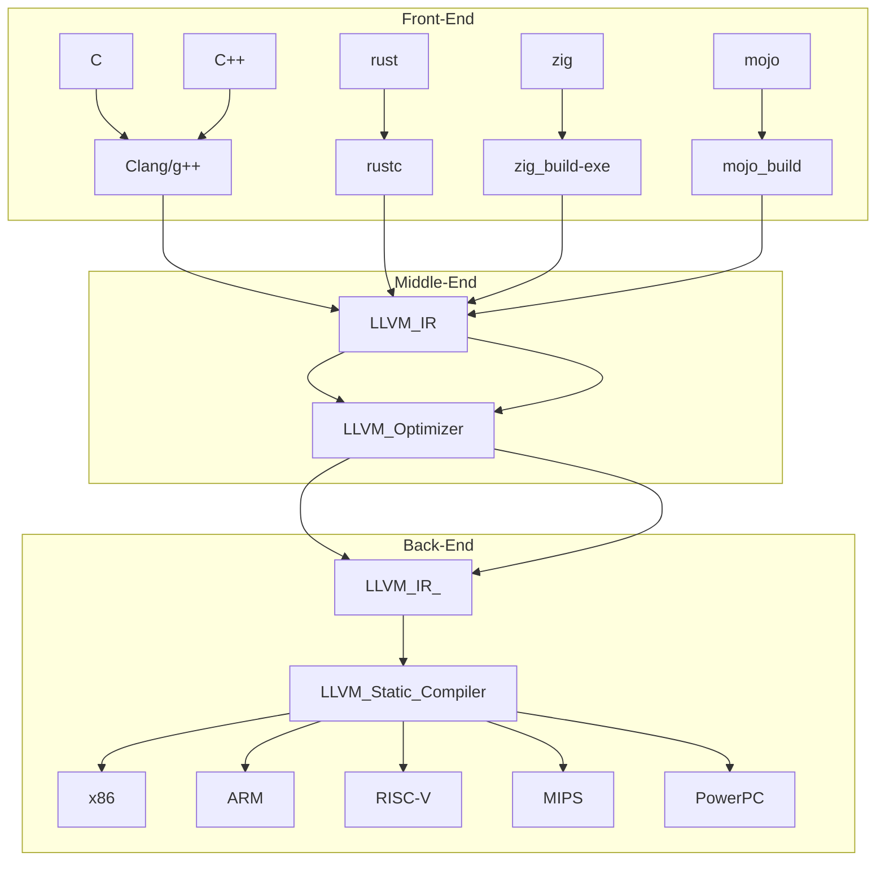
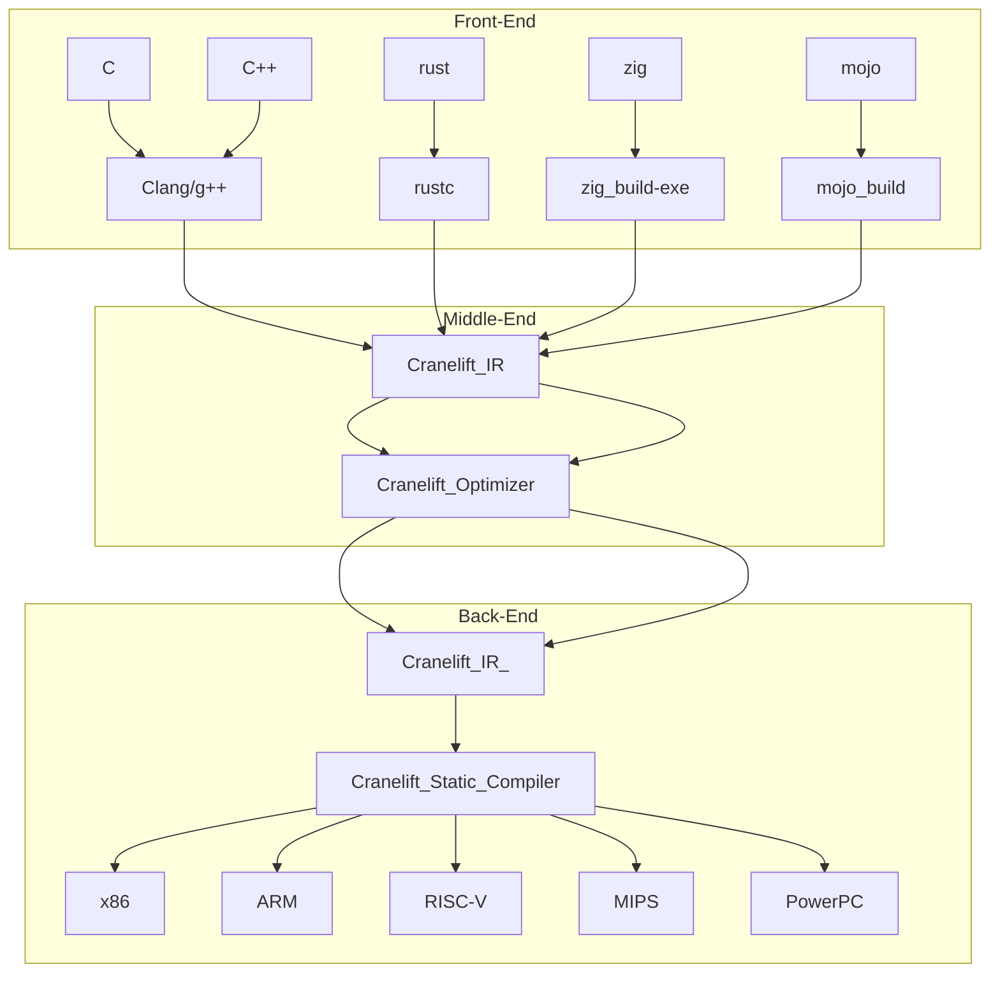

# link
- [LLVM-IR 컴파일 과정 그림으로 이해하기(HIR, MIRI, Borrow Check, Type Check전 과정 이해](#llvm의-과정)

- [Cranelift과정 그림으로 이해](#cranelift)

<hr />

# (cranelift)LLVM때문에 컴파일 더이상 빨라지지 않아 나온 cranelift[|🔝|](#link)
- https://github.com/bytecodealliance/wasmtime/tree/main/cranelift
- [(241014)Compilers in Rust: Cranelift, the All-Rust Codegen Alternative to LLVM (No C/C++, Part 1) ||regionaltantrums](https://youtu.be/ilhSdmv6bAY?si=-MFAacNFzRw0oQ_j)


<hr />

# **[gccrs: Rust를 위한 대체 컴파일러](<https://news.hada.io/topic?id=17681&utm_source=discord&utm_medium=bot&utm_campaign=1480>)**[|🔝|](#link)
- https://blog.rust-lang.org/2024/11/07/gccrs-an-alternative-compiler-for-rust.html
- `gccrs`는 GCC 프로젝트의 일환으로 개발 중인 대체 Rust 컴파일러입니다.  
- 이 프로젝트는 GNU 컴파일러 컬렉션 내에서 Rust를 지원하는 것을 목표로 하며, `rustc`와 동일한 동작을 목표로 합니다.  
- 주요 목표는 특히 LLVM이 지원하지 않는 플랫폼에서 Rust를 컴파일할 수 있는 대안을 제공하는 것입니다.  
...
- https://github.com/Rust-GCC/gccrs


<hr />

<br />

# 러스트에서 LLVM 어떻게 돌아가는지 설명해 주는 귀한 자료요 ㅋ[|🔝|](#link)
# 2024 LLVM Developers' Meeting - Rust ❤️ LLVM
- https://youtu.be/Kqz-umsAnk8?si=NLogEP1h-CXUSXPy

# What is LLVM: How It Powers Modern Compilers and Optimizes Code | The Coding Gopher[|🔝|](#link)
- https://youtu.be/3WojCM9r0Ls?si=B6lyo_ABG1ixQozi

<hr />

# Mentorship Session: Using Clang and LLVM to Build the Linux Kernel | The Linux Foundation[|🔝|](#link)
- https://youtu.be/y458QwEfSsU?si=2BPk9Q2EUfqWYPmP
  - https://nathanchance.dev/

# What is LLVM?(3min 41sec)[|🔝|](#link)

||LLVM|GNU|
|-|-|-|
|C compiler|clang|gcc|
|Assembler|"Integrated"|as|
|Linker|ld.lld|ld|
|Binary utilities|llvm-nm,<br />llvm-objcopy,<br />llvm-objdump,<br />llvm-strip, ...<br />|nv, objcopy,<br /> objdump,<br /> strip, ...<br />|

- 100초 설명
  - [LLVM in 100 Seconds | Fireship](https://youtu.be/BT2Cv-Tjq7Q?si=Hkiy6NyFNuZ5VTMm)

- 언어별 LLVM과정 그림으로
  - https://github.com/YoungHaKim7/Rust_Tutorial_Full_course/tree/main/23_Rust_LLVM_IR#llvm-ir-and-rust

- Rust의 대략 적인 컴파일 과정 IR, HIR, MIR
  - https://github.com/YoungHaKim7/Rust_Tutorial_Full_course/tree/main/23_Rust_LLVM_IR

# Install[|🔝|](#link)

- Debian /Ubuntu

```bash
apt install clang lld llvm
```

- Arch : `pacman -S clang lld llvm`

- Fedora: `dnf install clang lld llvm`

- or apt.llvm.org for newer releases(https://apt.llvm.org/)

# `clang`[|🔝|](#link)
- C language frontend for LLVM (other language frontends exist, such as rustc)
  - LLVM용 C 언어 프론트엔드(rustc와 같은 다른 언어 프론트엔드가 존재함) 
- Advertised as generally drop-in compatible with GCC일반적으로 GCC와 호환되는 드롭인으로 광고됨
  - Somewhat the case in reality, some flags may not be implemented, so kernel handles this in a few different ways
    - 실제로는 일부 플래그가 구현되지 않을 수 있으므로 커널은 몇 가지 다른 방식으로 이 문제를 처리합니다
- Multi-targeted binary, change target with - target instead of separate binaries
  - 다중 타겟 바이너리, 별도의 바이너리 대신 타겟으로 타겟 변경

```
clang --target=aarch64-linux-gnu

vs.

clang --target=aarch64-linux-gnu-gcc
```

- Takes C files, generates LLVM IR (intermediate representation), mutates that through a series of optimization passes, then hands it off for a target specific backend to perform target specific optimizations and actually generate the machine code
  - C개의 파일을 가져다가 LLVM IR(중간 표현)을 생성하고 일련의 최적화 패스를 통해 돌연변이를 일으킨 다음 대상 특정 백엔드에 전달하여 대상 특정 최적화를 수행하고 실제로 기계 코드를 생성합니다 


# `Id.lld` (8분23초)[|🔝|](#link)
- https://youtu.be/y458QwEfSsU?si=XwFAPoJ2QFdF3bHf&t=505
- LLVM's linker
- Advertised as being compatible with the GNU linker (in a similar manner as clang)
  - GNU 링커와 호환된다고 광고되었습니다(클랑과 유사한 방식으로)
- Multi-targeted binary like clang
  - clang과 같은 다중 표적 바이너리
- Generally faster at linking than GNU Id, especially when debug information is involved
  - 일반적으로 디버그 정보가 포함된 경우 GNU ID보다 빠르게 연결됩니다.

# LLVM의 과정[|🔝|](#link)
<p align="center">
  
</p>

- 출처 : https://blog.rust-lang.org/2016/04/19/MIR.html

- LLVM 


<hr />

# Cranelift[|🔝|](#link)
- https://cranelift.dev/
  - https://github.com/bytecodealliance/wasmtime/tree/main/cranelift/docs/
- [(241014)Compilers in Rust: Cranelift, the All-Rust Codegen Alternative to LLVM (No C/C++, Part 1) ||regionaltantrums](https://youtu.be/ilhSdmv6bAY?si=-MFAacNFzRw0oQ_j)


