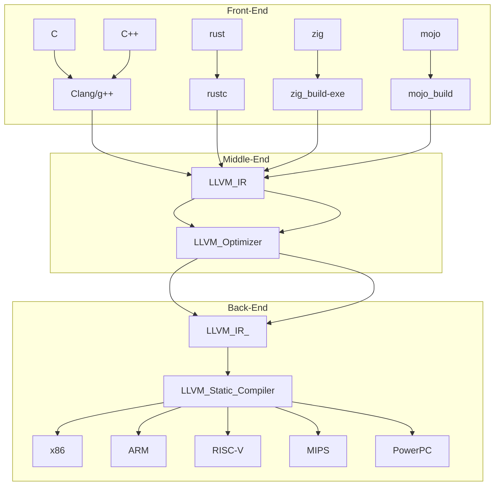

- [rust%EF%B8%8F러스트-o-오브젝트obj%EF%B8%8F-파일-만드는-방법how-create-obj-file-from-rust-code](#rust%EF%B8%8F러스트-o-오브젝트obj%EF%B8%8F-파일-만드는-방법how-create-obj-file-from-rust-code)
- [cargo-asm-사용법_기타-등등](#cargo-asm-기타-등등)

<hr>

# Rust❤️러스트 .o 오브젝트(obj❤️) 파일 만드는 방법How create .obj file from Rust code

- https://users.rust-lang.org/t/how-create-obj-file-from-rust-code-without-core-panic/40441/15

- https://modexp.wordpress.com/2018/10/30/arm64-assembly/

<hr>

# 1.74 cargo rustc 내용

https://github.com/rust-lang/rust/pull/114183/

# cargo rustc에 대해서 

https://doc.rust-lang.org/rustc/command-line-arguments.html


<p align="center">
  
</p>

- 출처 : https://blog.rust-lang.org/2016/04/19/MIR.html

<br>

- src/main.rs

```rs
use ndarray::{Array, Array1, ShapeBuilder};

fn main() {
    let a = Array::from_shape_vec((3, 3), Array1::range(0., 9., 1.).to_vec());
    let b = Array::from_shape_vec((2, 2).strides((1, 2)), vec![1., 2., 3., 4.]).unwrap();
    println!("create array 01 bool : {:?}", a.is_ok());
    println!("create array : {:?}", b);
}

```

- cargo rustc -- -Zunpretty=hir
```bash
cargo rustc -- -Zunpretty=hir

info: syncing channel updates for 'nightly-x86_64-pc-windows-msvc'
info: latest update on 2024-01-09, rust version 1.77.0-nightly (ca663b06c 2024-01-08)
info: installing component 'rustfmt'
   Compiling autocfg v1.1.0
   Compiling rawpointer v0.2.1
   Compiling num-traits v0.2.17
   Compiling num-integer v0.1.45
   Compiling matrixmultiply v0.3.8
   Compiling num-complex v0.4.4
   Compiling ndarray v0.15.6
   Compiling testrust01 v0.1.0 (D:\young_linux\11111\testrust01)
#[prelude_import]
use std::prelude::rust_2021::*;
#[macro_use]
extern crate std;
use ndarray::{};
use ndarray::Array;
use ndarray::Array1;
use ndarray::ShapeBuilder;

fn main() {
        let a =
            Array::from_shape_vec((3, 3), Array1::range(0., 9., 1.).to_vec());
        let b =
            Array::from_shape_vec((2, 2).strides((1, 2)),
                    <[_]>::into_vec(
                        #[rustc_box]
                        ::alloc::boxed::Box::new([1., 2., 3., 4.]))).unwrap();
        {
                ::std::io::_print(format_arguments::new_v1(&["create array 01 bool : ",
                                    "\n"], &[format_argument::new_debug(&a.is_ok())]));
            };
        {
                ::std::io::_print(format_arguments::new_v1(&["create array : ",
                                    "\n"], &[format_argument::new_debug(&b)]));
            };
    }
    Finished dev [unopt
```

- cargo asm
  - https://github.com/gnzlbg/cargo-asm

- ```cargo rustc -- -Zunpretty=mir```

```bash
cargo rustc -- -Zunpretty=mir
   Compiling testrust01 v0.1.0 (D:\young_linux\11111\testrust01)
// WARNING: This output format is intended for human consumers only
// and is subject to change without notice. Knock yourself out.
fn main() -> () {
    let mut _0: ();
    let _1: std::result::Result<ndarray::ArrayBase<ndarray::OwnedRepr<f64>, ndarray::Di
m<[usize; 2]>>, ndarray::ShapeError>;
    let mut _2: (usize, usize);
    let mut _3: std::vec::Vec<f64>;
    let mut _4: &ndarray::ArrayBase<ndarray::OwnedRepr<f64>, ndarray::Dim<[usize; 1]>>;
    let _5: ndarray::ArrayBase<ndarray::OwnedRepr<f64>, ndarray::Dim<[usize; 1]>>;
    let mut _7: std::result::Result<ndarray::ArrayBase<ndarray::OwnedRepr<f64>, ndarray
::Dim<[usize; 2]>>, ndarray::ShapeError>;
    let mut _8: ndarray::StrideShape<ndarray::Dim<[usize; 2]>>;
    let mut _9: (usize, usize);
    let mut _10: (usize, usize);
    let mut _11: std::vec::Vec<f64>;
    let mut _12: std::boxed::Box<[f64]>;
    let mut _13: usize;
    let mut _14: usize;
    let mut _15: *mut u8;
    let mut _16: std::boxed::Box<[f64; 4]>;
    let _17: ();
    let mut _18: std::fmt::Arguments<'_>;
    let mut _19: &[&str];
    let mut _20: &[core::fmt::rt::Argument<'_>];
    let _21: &[core::fmt::rt::Argument<'_>; 1];
    let _22: [core::fmt::rt::Argument<'_>; 1];
    let mut _23: core::fmt::rt::Argument<'_>;
    let _24: &bool;
    let _25: bool;
    let mut _26: &std::result::Result<ndarray::ArrayBase<ndarray::OwnedRepr<f64>, ndarr
ay::Dim<[usize; 2]>>, ndarray::ShapeError>;
    let _27: ();
    let mut _28: std::fmt::Arguments<'_>;
    let mut _29: &[&str];
    let mut _30: &[core::fmt::rt::Argument<'_>];
    let _31: &[core::fmt::rt::Argument<'_>; 1];
    let _32: [core::fmt::rt::Argument<'_>; 1];
    let mut _33: core::fmt::rt::Argument<'_>;
    let _34: &ndarray::ArrayBase<ndarray::OwnedRepr<f64>, ndarray::Dim<[usize; 2]>>;
    let mut _37: *const [f64; 4];
    scope 1 {
        debug a => _1;
        let _6: ndarray::ArrayBase<ndarray::OwnedRepr<f64>, ndarray::Dim<[usize; 2]>>;
        let mut _38: *const ();
        let mut _39: usize;
        let mut _40: usize;
        let mut _41: usize;
        let mut _42: usize;
        let mut _43: bool;
        scope 2 {
            debug b => _6;
            let mut _35: &[&str; 2];
            let mut _36: &[&str; 2];
        }
        scope 3 {
        }
    }

    bb0: {
        _2 = (const 3_usize, const 3_usize);
        _5 = ndarray::impl_constructors::<impl ArrayBase<OwnedRepr<f64>, Dim<[usize; 1]
>>>::range(const 0f64, const 9f64, const 1f64) -> [return: bb1, unwind continue];
    }

    bb1: {
        _4 = &_5;
        _3 = ndarray::impl_1d::<impl ArrayBase<OwnedRepr<f64>, Dim<[usize; 1]>>>::to_ve
c(move _4) -> [return: bb2, unwind: bb21];
    }

    bb2: {
        _1 = ndarray::impl_constructors::<impl ArrayBase<OwnedRepr<f64>, Dim<[usize; 2]
>>>::from_shape_vec::<(usize, usize)>(move _2, move _3) -> [return: bb3, unwind: bb21];
    }

    bb3: {
        drop(_5) -> [return: bb4, unwind: bb20];
    }

    bb4: {
        _9 = (const 2_usize, const 2_usize);
        _10 = (const 1_usize, const 2_usize);
        _8 = <(usize, usize) as ShapeBuilder>::strides(move _9, move _10) -> [return: b
b5, unwind: bb20];
    }

    bb5: {
        _13 = SizeOf([f64; 4]);
        _14 = AlignOf([f64; 4]);
        _15 = alloc::alloc::exchange_malloc(move _13, move _14) -> [return: bb6, unwind
: bb20];
    }

    bb6: {
        _16 = ShallowInitBox(move _15, [f64; 4]);
        _37 = (((_16.0: std::ptr::Unique<[f64; 4]>).0: std::ptr::NonNull<[f64; 4]>).0:
*const [f64; 4]);
        _38 = _37 as *const () (PtrToPtr);
        _39 = _38 as usize (Transmute);
        _40 = AlignOf([f64; 4]);
        _41 = Sub(_40, const 1_usize);
        _42 = BitAnd(_39, _41);
        _43 = Eq(_42, const 0_usize);
        assert(_43, "misaligned pointer dereference: address must be a multiple of {} b
ut is {}", _40, _39) -> [success: bb23, unwind unreachable];
    }

    bb7: {
        _7 = ndarray::impl_constructors::<impl ArrayBase<OwnedRepr<f64>, Dim<[usize; 2]
>>>::from_shape_vec::<StrideShape<Dim<[usize; 2]>>>(move _8, move _11) -> [return: bb8,
 unwind: bb20];
    }

    bb8: {
        _6 = Result::<ArrayBase<OwnedRepr<f64>, Dim<[usize; 2]>>, ShapeError>::unwrap(m
ove _7) -> [return: bb9, unwind: bb20];
    }

    bb9: {
        _36 = const _;
        _19 = _36 as &[&str] (PointerCoercion(Unsize));
        _26 = &_1;
        _25 = Result::<ArrayBase<OwnedRepr<f64>, Dim<[usize; 2]>>, ShapeError>::is_ok(m
ove _26) -> [return: bb10, unwind: bb19];
    }

    bb10: {
        _24 = &_25;
        _23 = core::fmt::rt::Argument::<'_>::new_debug::<bool>(_24) -> [return: bb11, u
nwind: bb19];
    }

    bb11: {
        _22 = [move _23];
        _21 = &_22;
        _20 = _21 as &[core::fmt::rt::Argument<'_>] (PointerCoercion(Unsize));
        _18 = Arguments::<'_>::new_v1(move _19, move _20) -> [return: bb12, unwind: bb1
9];
    }

    bb12: {
        _17 = _print(move _18) -> [return: bb13, unwind: bb19];
    }

    bb13: {
        _35 = const _;
        _29 = _35 as &[&str] (PointerCoercion(Unsize));
        _34 = &_6;
        _33 = core::fmt::rt::Argument::<'_>::new_debug::<ArrayBase<OwnedRepr<f64>, Dim<
[usize; 2]>>>(_34) -> [return: bb14, unwind: bb19];
    }

    bb14: {
        _32 = [move _33];
        _31 = &_32;
        _30 = _31 as &[core::fmt::rt::Argument<'_>] (PointerCoercion(Unsize));
        _28 = Arguments::<'_>::new_v1(move _29, move _30) -> [return: bb15, unwind: bb1
9];
    }

    bb15: {
        _27 = _print(move _28) -> [return: bb16, unwind: bb19];
    }

    bb16: {
        drop(_6) -> [return: bb17, unwind: bb20];
    }

    bb17: {
        drop(_1) -> [return: bb18, unwind continue];
    }

    bb18: {
        return;
    }

    bb19 (cleanup): {
        drop(_6) -> [return: bb20, unwind terminate(cleanup)];
    }

    bb20 (cleanup): {
        drop(_1) -> [return: bb22, unwind terminate(cleanup)];
    }

    bb21 (cleanup): {
        drop(_5) -> [return: bb22, unwind terminate(cleanup)];
    }

    bb22 (cleanup): {
        resume;
    }

    bb23: {
        (*_37) = [const 1f64, const 2f64, const 3f64, const 4f64];
        _12 = move _16 as std::boxed::Box<[f64]> (PointerCoercion(Unsize));
        _11 = slice::<impl [f64]>::into_vec::<std::alloc::Global>(move _12) -> [return:
 bb7, unwind: bb20];
    }
}

promoted[0] in main: &[&str; 2] = {
    let mut _0: &[&str; 2];
    let mut _1: [&str; 2];

    bb0: {
        _1 = [const "create array : ", const "\n"];
        _0 = &_1;
        return;
    }
}

promoted[1] in main: &[&str; 2] = {
    let mut _0: &[&str; 2];
    let mut _1: [&str; 2];

    bb0: {
        _1 = [const "create array 01 bool : ", const "\n"];
        _0 = &_1;
        return;
    }
}
    Finished dev [unoptimized + debuginfo] target(s) in 0.67s
```

- ```cargo rustc -- --emit llvm-ir && cat .\target\debug\deps\testrust01.ll```

```bash

$ cargo rustc -- --emit llvm-ir && cat .\target\debug\deps\testrust01.ll


...
...
...

코드가 겁나게 많다. 

...
!12775 = distinct !DISubprogram(name: "new<ndarray::ArrayBase<ndar
ray::data_repr::OwnedRepr<f64>,ndarray::dimension::dim::Dim<array$
<usize,2> > > >", linkageName: "_ZN4core3fmt2rt8Argument3new17h0fb
bb2618fd00175E", scope: !3030, file: !3029, line: 83, type: !12776
, scopeLine: 83, flags: DIFlagPrototyped, spFlags: DISPFlagLocalTo
Unit | DISPFlagDefinition, unit: !330, templateParams: !3989, decl
aration: !12779, retainedNodes: !12780)
!12776 = !DISubroutineType(types: !12777)
!12777 = !{!3030, !8337, !12778}
!12778 = !DIDerivedType(tag: DW_TAG_pointer_type, name: "enum2$<co
re::result::Result<tuple$<>,core::fmt::Error> > (*)(ref$<ndarray::
ArrayBase<ndarray::data_repr::OwnedRepr<f64>,ndarray::dimension::d
im::Dim<array$<usize,2> > > >,ref_mut$<core::fmt::Formatter>)", ba
seType: !8553, size: 64, align: 64, dwarfAddressSpace: 0)
!12779 = !DISubprogram(name: "new<ndarray::ArrayBase<ndarray::data
_repr::OwnedRepr<f64>,ndarray::dimension::dim::Dim<array$<usize,2>
 > > >", linkageName: "_ZN4core3fmt2rt8Argument3new17h0fbbb2618fd0
0175E", scope: !3030, file: !3029, line: 83, type: !12776, scopeLi
ne: 83, flags: DIFlagPrototyped, spFlags: DISPFlagLocalToUnit, tem
plateParams: !3989)
!12780 = !{!12773, !12781}
!12781 = !DILocalVariable(name: "f", arg: 2, scope: !12774, file:
!3029, line: 83, type: !12778)
!12782 = !DILocation(line: 83, scope: !12774, inlinedAt: !12783)
!12783 = distinct !DILocation(line: 101, scope: !12766, inlinedAt:
 !12772)
!12784 = !DILocation(line: 101, scope: !12766, inlinedAt: !12772)
!12785 = !DILocation(line: 92, scope: !12774, inlinedAt: !12783)
!12786 = !DILocation(line: 102, scope: !12766, inlinedAt: !12772)
!12787 = !DILocation(line: 7, scope: !12733)
!12788 = !DILocation(line: 3, scope: !12727)

```

- cargo hir
  - https://gist.github.com/niklasad1/b838695ef436a0a16d5cd80cf462905f

# Expand macros
`$ cargo rustc --profile=check -- -Zunpretty=expanded`
<br>`$ cargo expand`

- https://github.com/dtolnay/cargo-expand

# Emit asm
`$ cargo rustc -- --emit asm && cat target/debug/deps/project_name-hash.s`
<br>`$ cargo rustc -- --emit asm=asssembly.s`

# Emit llvm-ir
`$ cargo rustc -- --emit llvm-ir && cat target/debug/deps/project_name-hash.ll`
<br>`$ cargo rustc -- --emit llvm-ir=testrust.ll`

# Emit HIR
`$ cargo rustc -- -Zunpretty=hir`

# Emit MIR
`$ cargo rustc -- -Zunpretty=mir`
<br>`$ cargo rustc -- --emit mir=testrust.mir`

# cargo rustc -- --emit dep-info=testrust.depinfo

```
cargo rustc -- --emit dep-info=testrust.depinfo
```

# cargo rustc -- --emit help

```
cargo rustc -- --emit help
   Compiling testrust01 v0.1.0 (D:\young_linux\11111\testrust01)
error: unknown emission type: `help` - expected one of:

`llvm-bc`,
`asm`,
`llvm-ir`,
 `mir`,
`obj`,
`metadata`,
`link`,
`dep-info`
```
# .pdb

- Microsoft released the source code of their PDB formats, so other compiler developers like the LLVM team can implement the PDB format easier.
  - https://github.com/Microsoft/microsoft-pdb/
    - To actually dump the output of a file, just use this:
       - https://github.com/Microsoft/microsoft-pdb/blob/master/cvdump/cvdump.exe


<hr>


- Rust 1.74.0: All 45 changes in 19 minutes! | Nathan Stocks(6min 36sec)
  - https://youtu.be/MOzuShpnUm8?si=GArUM-7CqH6TVbeD


<hr>

# LLVM IR and Rust

```
llvm -> clang C언어 C++
g++
clangd -> C언어의 LSP 지원 -> 타입이 나온다.type

c / c++ / zig  / rust 

```

<li><strong><em>Front-end:</em></strong> compiles source language to IR.</li>

<li><strong><em>Middle-end:</em></strong> optimizes IR.
    
<li><strong><em>Back-end:</em></strong> compiles IR to machine code.


    
    

    
```
    ```mermaid
    lowchart TB
    LLVM_IR-->LLVM_Optimizer
    LLVM_Optimizer-->LLVM_IR_
    subgraph Back-End
    LLVM_IR_-->LLVM_Static_Compiler
    LLVM_Static_Compiler-->x86 & ARM & RISC-V & MIPS & PowerPC
    end
    subgraph Middle-End
    LLVM_IR-->LLVM_Optimizer
    LLVM_Optimizer-->LLVM_IR_
    end
    subgraph Front-End
    C & C++--> Clang/g++
    Clang/g++ --> LLVM_IR
    rust --> rustc
    rustc --> LLVM_IR
    zig--> zig_build-exe
    zig_build-exe --> LLVM_IR
    mojo --> mojo_build
    mojo_build --> LLVM_IR
    end
    
    ```
```

https://blog.gopheracademy.com/advent-2018/llvm-ir-and-go/
    
    
# Rust 더 자세한 Debugging __llvm 코드 보는법
    
- https://github.com/YoungHaKim7/Rust_Tutorial_Full_course/tree/main/22_Rust_Debugging_rust-lldb_rd


<hr>


# An interpreter for Rust's mid-level intermediate representation

https://github.com/rust-lang/miri


- Install Miri on Rust nightly via ```rustup```

```
rustup +nightly component add miri

```

# Scientific papers employing Miri

- <a href="https://plv.mpi-sws.org/rustbelt/stacked-borrows/">Stacked Borrows: An Aliasing Model for Rust</a>

- <a href="https://www.amazon.science/publications/using-lightweight-formal-methods-to-validate-a-key-value-storage-node-in-amazon-s3">Using Lightweight Formal Methods to Validate a Key-Value Storage Node in Amazon S3</a>

- <a href="https://dl.acm.org/doi/10.1145/3453483.3454084">SyRust: Automatic Testing of Rust Libraries with Semantic-Aware Program Synthesis</a>


# pacak/cargo-show-asm

cargo subcommand showing the assembly, LLVM-IR and MIR generated for Rust code

https://github.com/pacak/cargo-show-asm

- Install

```
$ cargo install cargo-show-asm
```

- cargo asm

```
$ cargo asm --lib
Try one of those
"<&T as core::fmt::Display>::fmt" [17, 12, 12, 12, 12, 19, 19, 12]
"<&mut W as core::fmt::Write>::write_char" [20]
"<&mut W as core::fmt::Write>::write_fmt" [38]
"<&mut W as core::fmt::Write>::write_str" [90]
"<F as nom::internal::Parser<I,O,E>>::parse" [263]
#
```

## cargo asm --llvm-input 

```
cargo asm --llvm-input
   Compiling trait_impl v0.1.0 (/Users/globalyoung/Documents/test/test/YouTubeContents_GlobalYoung/230317_Rust_Monomorphization_vs_Polymorphism/Polymorphism/trait_impl)
    Finished release [optimized] target(s) in 0.29s

Try one of those by name or a sequence number
 0 "<() as std::process::Termination>::report" [6]
 1 "<trait_impl::Bear as trait_impl::Growler>::growl" [13]
 2 "<trait_impl::Lion as trait_impl::Growler>::growl" [13]
 3 "<trait_impl::Tiger as trait_impl::Growler>::growl" [13]
 4 "Function Attrs: uwtable" [23]
 5 "core::fmt::Arguments::new_v1" [60]
 6 "core::ops::function::FnOnce::call_once" [36, 8]
 8 "core::ops::function::FnOnce::call_once{{vtable.shim}}" [10]
 9 "core::ptr::drop_in_place<std::rt::lang_start<()>::{{closure}}>" [6]
10 "std::rt::lang_start" [17]
11 "std::rt::lang_start::{{closure}}" [17]
12 "std::sys_common::backtrace::__rust_begin_short_backtrace" [22]
13 "trait_impl::main" [12]
14 "trait_impl::static_dispatch" [34, 34, 34]
```

## cargo asm --llvm

```
cargo asm --llvm
   Compiling trait_impl v0.1.0 (/Users/globalyoung/Documents/test/test/YouTubeContents_GlobalYoung/230317_Rust_Monomorphization_vs_Polymorphism/Polymorphism/trait_impl)
    Finished release [optimized] target(s) in 0.09s

Try one of those by name or a sequence number
0 "<trait_impl::Bear as trait_impl::Growler>::growl" [20]
1 "<trait_impl::Lion as trait_impl::Growler>::growl" [20]
2 "<trait_impl::Tiger as trait_impl::Growler>::growl" [20]
3 "Function Attrs: uwtable" [23]
4 "core::ops::function::FnOnce::call_once{{vtable.shim}}" [9]
5 "core::ptr::drop_in_place<std::rt::lang_start<()>::{{closure}}>" [6]
6 "std::rt::lang_start" [12]
7 "std::rt::lang_start::{{closure}}" [9]
8 "std::sys_common::backtrace::__rust_begin_short_backtrace" [8]
9 "trait_impl::main" [12]
```

## cargo asm --mir

```
cargo asm --mir
   Compiling trait_impl v0.1.0 (/Users/globalyoung/Documents/test/test/YouTubeContents_GlobalYoung/230317_Rust_Monomorphization_vs_Polymorphism/Polymorphism/trait_impl)
    Finished release [optimized] target(s) in 0.09s

Try one of those by name or a sequence number
 0 "fn <impl at src/main.rs:13:1: 13:23>::growl(_1: &Tiger)" [63]
 1 "fn <impl at src/main.rs:20:1: 20:22>::growl(_1: &Bear)" [63]
 2 "fn <impl at src/main.rs:6:1: 6:22>::growl(_1: &Lion)" [65]
 3 "fn main()" [46]
 4 "fn static_dispatch(_1: T)" [34]
 5 "promoted[0] in <impl at src/main.rs:13:1: 13:23>::growl: &[ArgumentV1<'_>; 0]" [10]
 6 "promoted[0] in <impl at src/main.rs:20:1: 20:22>::growl: &[ArgumentV1<'_>; 0]" [10]
 7 "promoted[0] in <impl at src/main.rs:6:1: 6:22>::growl: &[ArgumentV1<'_>; 0]" [10]
 8 "promoted[1] in <impl at src/main.rs:13:1: 13:23>::growl: &[&str; 1]" [13]
 9 "promoted[1] in <impl at src/main.rs:20:1: 20:22>::growl: &[&str; 1]" [13]
10 "promoted[1] in <impl at src/main.rs:6:1: 6:22>::growl: &[&str; 1]" [13]
```

## cargo asm 기타 등등

```
cargo asm -h
Show the code rustc generates for any function

Usage: [-p SPEC] [--lib | --test TEST | --bench BENCH | --example EXAMPLE | --bin BIN] [--release | --dev | --profile PROFILE] [--target TRIPLE] -C FLAG... -Z FLAG... [--native | --target-cpu CPU] [--rust] [--simplify] -M ARG... [--intel | --att | --llvm | --llvm-input | --mir | --wasm | --mca-intel | --mca-att] [--everything | <ITEM_INDEX> | <FUNCTION> [<INDEX>]]

Usage:
  1. Focus on a single assembly producing target:
     % cargo asm -p isin --lib   # here we are targeting lib in isin crate
  2. Narrow down a function:
     % cargo asm -p isin --lib from_ # here "from_" is part of the function you are interested intel
  3. Get the full results:
     % cargo asm -p isin --lib isin::base36::from_alphanum

Available positional items:
    <ITEM_INDEX>  Dump name with this index
    <FUNCTION>    Dump function with that specific name / filter functions containing this string
    <INDEX>       Select specific function when there's several with the same name

Available options:
    -p, --package <SPEC>        Package to use, defaults to a current one, required for workspace projects, can also point
                                to a dependency
        --lib                   Show results from library code
        --test <TEST>           Show results from an integration test
        --bench <BENCH>         Show results from a benchmark
        --example <EXAMPLE>     Show results from an example
        --bin <BIN>             Show results from a binary
        --manifest-path <PATH>  Path to Cargo.toml, defaults to one in current folder
        --target-dir <DIR>      [env:CARGO_TARGET_DIR: N/A]
                                Use custom target directory for generated artifacts, create if missing
        --dry                   Produce a build plan instead of actually building
        --frozen                Requires Cargo.lock and cache are up to date
        --locked                Requires Cargo.lock is up to date
        --offline               Run without accessing the network
        --no-default-features   Do not activate `default` feature
        --all-features          Activate all available features
        --features <FEATURE>    A feature to activate, can be used multiple times
        --release               Compile in release mode (default)
        --dev                   Compile in dev mode
        --profile <PROFILE>     Build for this specific profile
        --target <TRIPLE>       Build for the target triple
    -C <FLAG>                   Codegen flags to rustc, see 'rustc -C help' for details
    -Z <FLAG>                   Unstable (nightly-only) flags to Cargo, see 'cargo -Z help' for details
        --native                Optimize for the CPU running the compiler
        --target-cpu <CPU>      Optimize code for a specific CPU, see 'rustc --print target-cpus'
        --rust                  Print interleaved Rust code
        --color                 Enable color highlighting
        --no-color              Disable color highlighting
        --full-name             Include full demangled name instead of just prefix
        --keep-labels           Keep all the original labels
    -v, --verbose               more verbose output, can be specified multiple times
        --simplify              Try to strip some of the non-assembly instruction information
    -M, --mca-arg <ARG>         Pass parameter to llvm-mca for mca targets
        --intel                 Show assembly using Intel style
        --att                   Show assembly using AT&T style
        --llvm                  Show llvm-ir
        --llvm-input            Show llvm-ir before any LLVM passes
        --mir                   Show MIR
        --wasm                  Show WASM, needs wasm32-unknown-unknown target installed
        --mca-intel             Show llvm-mca analysis, Intel style asm
        --mca-att               Show llvm-mca analysis, AT&T style asm
        --everything            Dump the whole asm file
    -h, --help                  Prints help information
    -V, --version               Prints version information
```

<br>

<hr>
